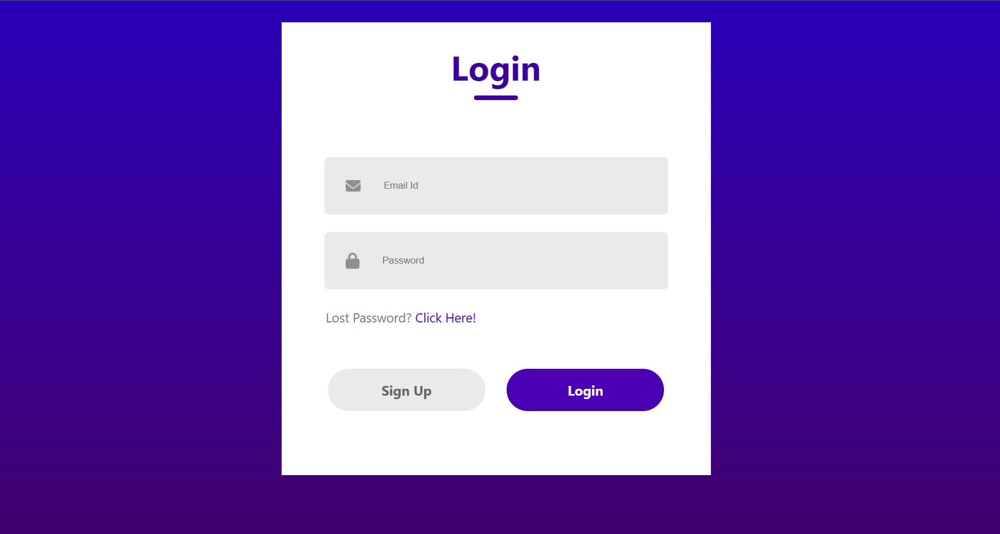
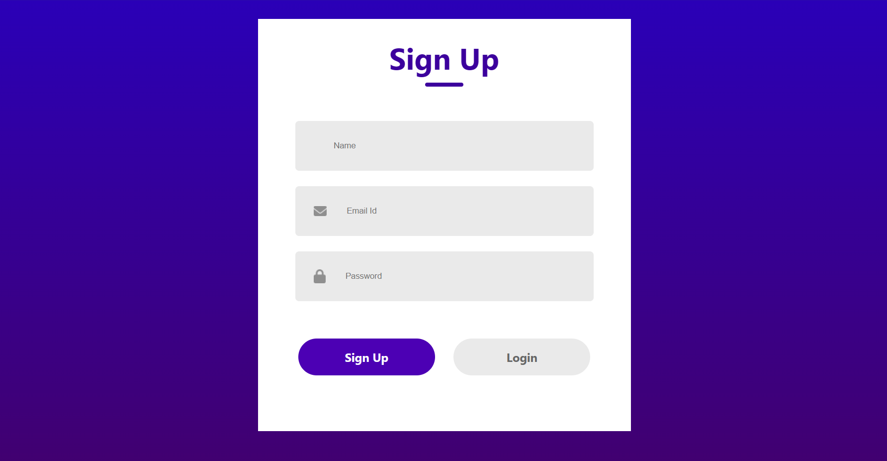

# 🔐 Login & Sign Up UI – React Component

A clean and minimal Login / Sign Up interface built using **React**. This UI component allows users to switch between login and registration views with a modern design and responsive layout.

---

## 📸 Preview

---

## ✨ Features

- Toggle between **Login** and **Sign Up** modes
- Responsive UI for desktop and mobile
- Icons for input fields (Name, Email, Password)
- Stylish and simple layout
- Easily customizable structure

---

## 🧱 Tech Stack

- ⚛️ React (Functional Components)
- 🎨 CSS (custom styles)
- 🖼️ Static Assets (PNG icons)

---

## 💡 To-Do / Future Enhancements
- Add real-time form validation
- Connect with backend authentication API
- Add animation/transitions for toggle
- Dark Mode support

---

## 👨‍💻 Author
Made with 💙 by Haadi
🔗 [GitHub Profile](https://github.com/m-waqas007)

## 📄 License
This project is open-source and free to use under the `MIT License`.